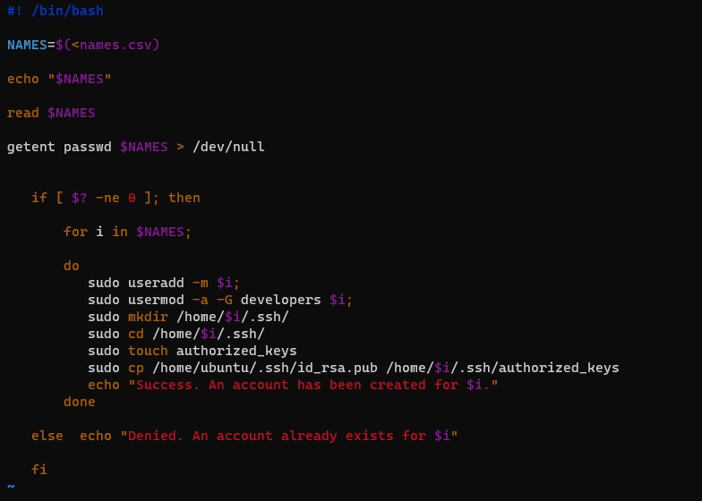
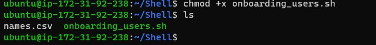
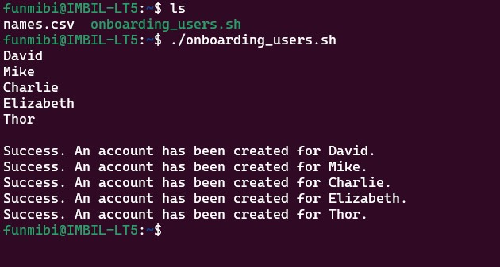
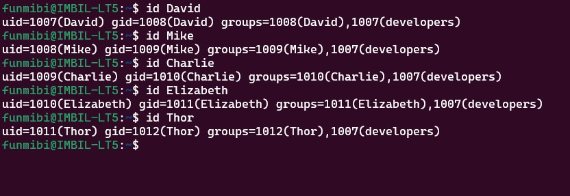
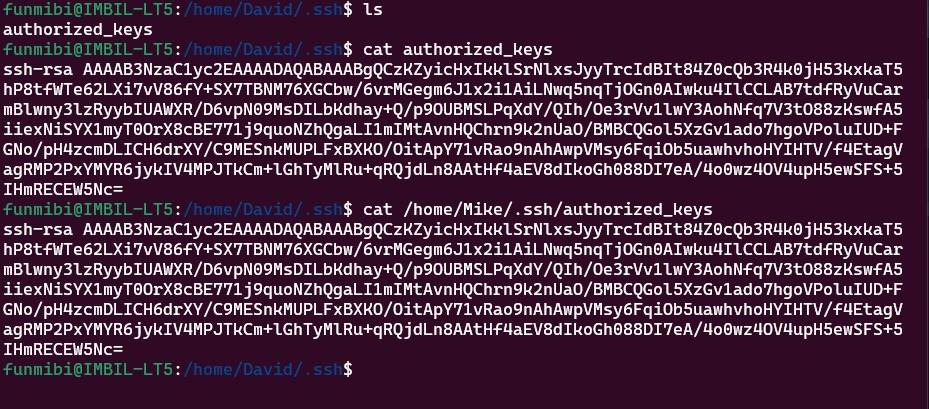
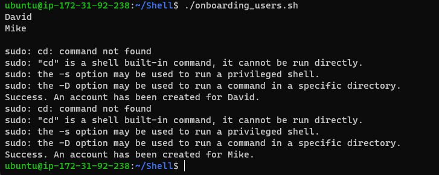

## Aux Project 1 - Shell Scripting

> Create a project called Shell

    mkdir Shell

> Navigate to the shell directory
  
    cd Shell

> Create a csv file named 'names.csv'

    touch names.csv

> Open the names.csv file and insert some random names into it.

    vim names.csv

> Cd into the current home directory, navigate to the .ssh directory

    cd .ssh

> Create a file for the public ssh key

    touch id_rsa.pub

> Open the file "id_rsa.pub" and paste the public key in it

    vim id_rsa.pub

> Create a script that does the following and run script on terminal

    - Script should be able to read the csv file containing names of new users
    - Script should be able to create new users and add them to an existing group

        **Note: create an exsiting group manually**
    - Script should be able to check if a user exists
    - Script should be able to create a new user with an home directory
    - Script should be able to create a '.ssh' directory within it 'HOME' directory.
    - Script should be able to create an 'authorized_keys' files and make sure it has the public key of the current user.

> After writing the script, give executable permissions and deploy it on the server

> Giving permissions

> Deploying script

    ./onboarding_users.sh

### NOTE: I had to deploy the script on my local (WSL) because of the sudo permission issue on the ec2 instance.

### Obstacles

1. I can not deploy the 'onboarding_users.sh' script successfully on my ec2 instance
2. I was not able to test users randomly to  ssh into the ec2 instance.

### Errors on the ec2 instance

